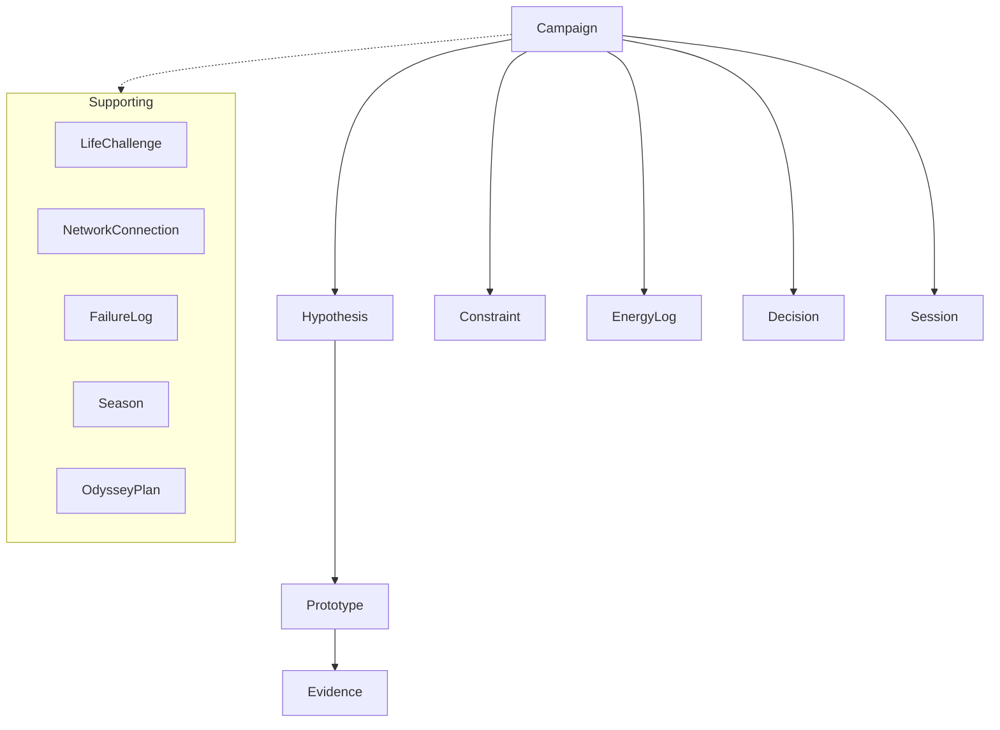
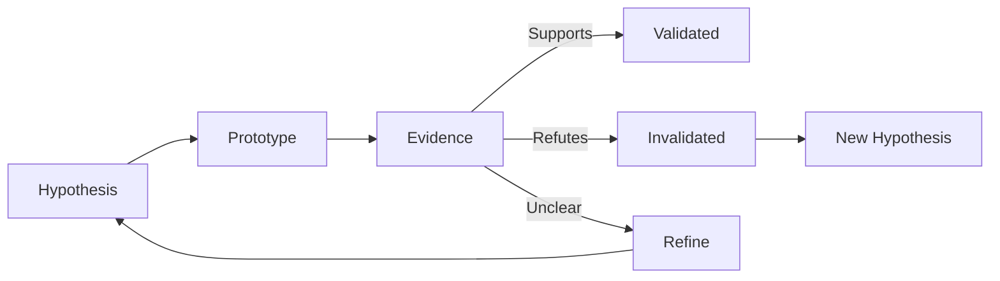
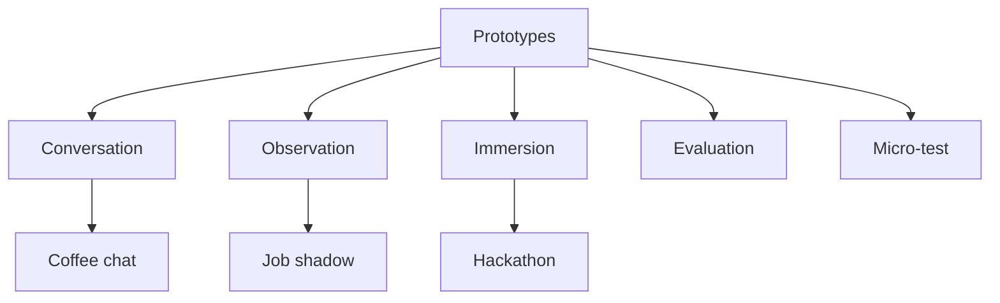
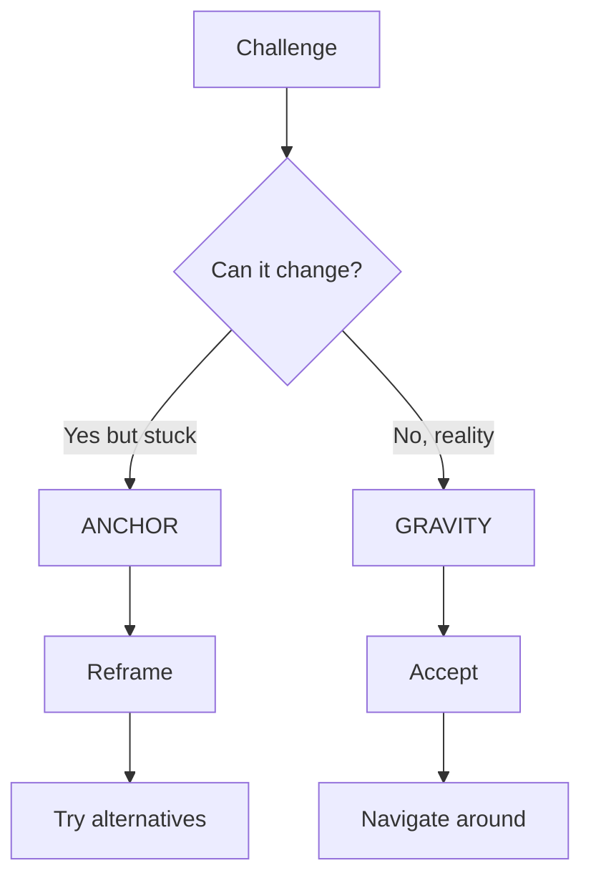

# Designing Your Life - OpenAPI Specification

[](https://spec.openapis.org/oas/v3.1.0)
[](https://vishnujayvel.github.io/designing-your-life-spec/)
[](LICENSE)

> A language-agnostic OpenAPI specification for implementing the "Designing Your Life" methodology as software.

## About This Project

This OpenAPI specification encodes the [Designing Your Life](https://designingyour.life/) framework into machine-readable contracts. The DYL methodology was created by **Bill Burnett** and **Dave Evans** at Stanford's Life Design Lab. This specification was created by **[Vishnu Jayavel](https://github.com/vishnujayvel)** to make the framework accessible to software developers and AI agents.

### Who is this for?

- **AI Agents** (Claude, GPT) - Build life coaching chatbots with methodology-aware behavior
- **Developers** - Create apps for career transitions, goal tracking, and life design
- **Productivity Tools** - Integrate DYL concepts into existing habit/goal tracking systems

## The Framework

Designing Your Life applies design thinking to personal growth. Instead of rigid 5-year plans, you:

1. **Form Hypotheses** - "Working at a startup would give me more autonomy"
2. **Run Prototypes** - Coffee chats, job shadowing, side projects
3. **Collect Evidence** - What did you learn? How did it feel?
4. **Iterate** - Refine your hypothesis or pivot

## Entity Hierarchy



## Core Concepts

| Concept | Description |
|---------|-------------|
| **Campaign** | A bounded exploration period around a life question |
| **Hypothesis** | A testable belief about what might work |
| **Prototype** | A small experiment (conversation, observation, immersion) |
| **Evidence** | Observations from prototypes - insights, data, emotions |
| **Gravity Problem** | Something you can't change (accept it, don't fight it) |
| **Anchor Problem** | Stuck on one solution (reframe to find alternatives) |

## The Learning Loop

The heart of DYL: hypothesize → prototype → learn → iterate.



## Prototype Types

Start with low-commitment prototypes, work up to immersion:



## Anchor vs Gravity Problems

Critical distinction! Know which type of problem you're facing:



## Meet the Characters

Throughout this spec, you'll find examples featuring **two people** navigating very different life design challenges. This shows how the DYL framework applies across any domain.

### The Tech Worker


A software engineer at **Hooli** (the corporate giant) wondering if the grass is greener at **Pied Piper** (the scrappy startup). Their campaign explores:
- *"Would I thrive in startup chaos or corporate stability?"*
- *"Is remote work actually better for my productivity?"*
- *"Should I stay IC or move into management?"*

Prototypes include coffee chats with startup CTOs, hackathon weekends, and shadowing sessions.

### Carmy Berzatto (The Bear)


A fine dining chef who returns to Chicago to run his late brother's Italian beef sandwich shop, **The Original Beef of Chicagoland**. Inspired by the TV show "The Bear," his campaign explores:
- *"Can fine dining techniques transform a sandwich shop without losing its soul?"*
- *"How do I develop my existing team rather than replacing them?"*
- *"How do I honor my brother's legacy while building something new?"*

Prototypes include menu experiments (handmade pasta specials), observation sessions (watching Richie work the window), and debrief conversations (talking systems with Sydney).

> **Why two characters?** Life design isn't just for career pivots. The framework works whether you're debugging code or plating pasta. Same methodology, different domains.

## AI-First Design

This spec includes extensions for LLM consumption:

- **`x-ai-instructions`** - Procedural guidance for AI agents
- **`x-ai-examples`** - Few-shot learning examples with input/output patterns

Example from `LifeChallenge`:
```yaml
x-ai-instructions: |
  ALWAYS classify as Anchor or Gravity FIRST.
  Do not attempt to solve before classification.
  Ask 2-3 probing questions to confirm classification.
```

## View the Spec Online

**No installation required!** View the full specification rendered as interactive documentation:

[](https://vishnujayvel.github.io/designing-your-life-spec/)

The spec is served via [GitHub Pages](https://pages.github.com/) using [Redoc](https://github.com/Redocly/redoc). You'll see:

- **Three-panel layout** - Navigation, content, and code examples
- **Interactive schemas** - Expand nested objects, see constraints
- **Try it examples** - Request/response patterns for each endpoint
- **Search** - Find any entity or property instantly

## Quick Start (Local Development)

### Preview Locally
```bash
# Install Redocly CLI
npm install -g @redocly/cli

# Build static HTML
redocly build-docs dyl-spec.yaml -o docs/redoc.html

# Or use Python's built-in server
cd docs && python -m http.server 8080
```

### Validate
```bash
redocly lint dyl-spec.yaml
```

### Bundle (single file)
```bash
redocly bundle dyl-spec.yaml -o dyl-spec-bundled.yaml
```

## Repository Structure

```
designing-your-life-spec/
├── dyl-spec.yaml           # Main OpenAPI 3.1 specification
├── schemas/                # Entity definitions
│   ├── campaign.yaml
│   ├── hypothesis.yaml
│   ├── prototype.yaml
│   ├── evidence.yaml
│   └── ...
├── rules/                  # DYL methodology rules
│   ├── anti-patterns.yaml  # Analysis paralysis, black holes
│   ├── balance-rules.yaml  # Work/Play/Love/Health
│   └── ...
├── integrations/           # Provider abstractions
│   ├── task-management/    # Asana, Todoist, etc.
│   └── calendar-events/    # Google Calendar, Outlook
├── docs/                   # GitHub Pages (auto-deployed)
│   ├── index.html          # Entry point (redirects)
│   └── redoc.html          # Pre-built interactive docs
└── .github/
    └── workflows/
        └── docs.yml        # Auto-rebuild on spec changes
```

## Anti-Pattern Detection

The spec includes rules for detecting common pitfalls:

| Anti-Pattern | Detection | Intervention |
|--------------|-----------|--------------|
| **Analysis Paralysis** | 5+ hypotheses, 0 prototypes | "You're thinking, not doing" |
| **Black Hole Applications** | Job apps silent >14 days | Prompt to mark as black-holed |
| **Premature Commitment** | Major decision without evidence | Require min 3 evidence entries |
| **Cognitive Bandwidth** | >7 open loops | Encourage closure or parking |

## Learn More About DYL

### Official Resources
- [Designing Your Life Book](https://www.amazon.com/Designing-Your-Life-Well-Lived-Joyful/dp/1101875321)
- [Official Website](https://designingyour.life/)
- [Stanford Life Design Lab](http://lifedesignlab.stanford.edu/resources)
- [Online Course (CreativeLive)](https://www.creativelive.com/class/designing-your-life-how-to-build-a-well-lived-joyful-life-bill-burnett-dave-evans)

### About the DYL Framework Authors
**Bill Burnett** - Executive Director of Stanford's Design Program
**Dave Evans** - Adjunct Lecturer at Stanford, co-founder of Electronic Arts

## Contributing

Contributions welcome! You can help by:

- Adding new prototype types
- Improving anti-pattern detection rules
- Adding provider mappings (Notion, Linear, etc.)
- Translating examples to other domains

See [CONTRIBUTING.md](CONTRIBUTING.md) for guidelines.

## License

MIT License - See [LICENSE](LICENSE) for details.

---

*"You can't know what you want until you know what you might want, so you should design many lives."*
— Bill Burnett & Dave Evans
